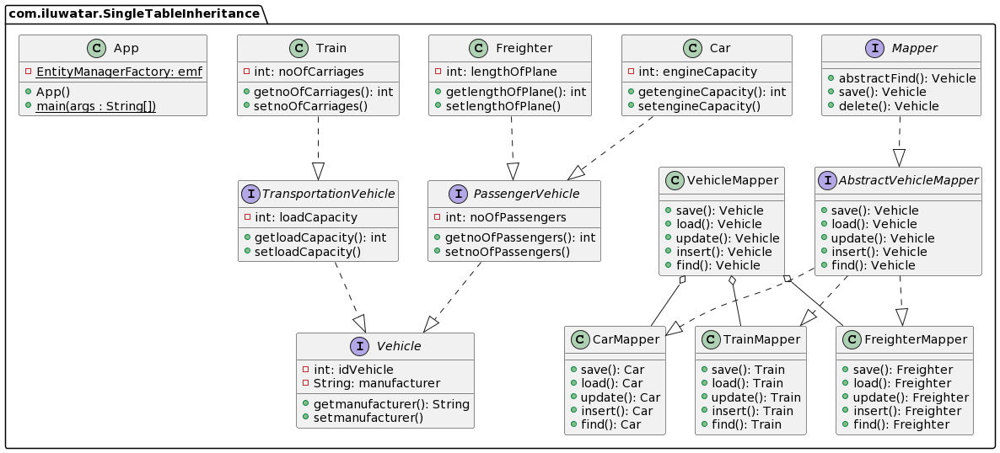

## Intent

Map all the fields of classes in an inheritance hierarchy into a single table

##Explanation
Relational database doesn't support inheritance, therefore when we process inherited class, there tend to be significance numbers of join operations.
Single Table Inheritance ensure that all class in the hierarchy is map to the same table

## Class diagram

## Programmatic Example

Use the Single Table Inheritance pattern when

* mapping from objects to relational database without needing join to retrieve data

